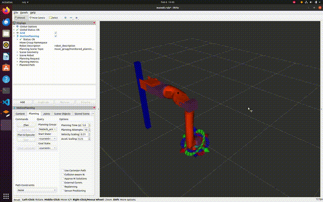
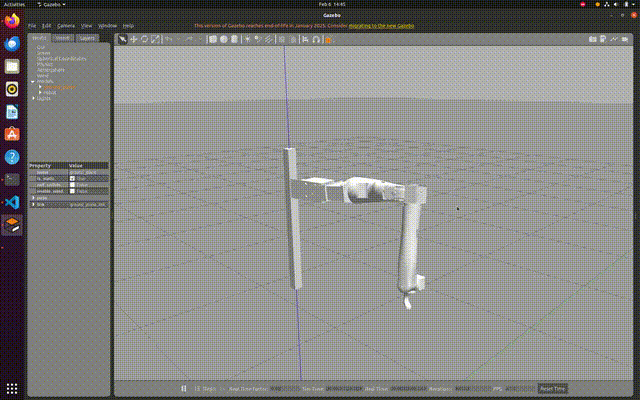

# Candle_ArmOnly-Feetech Arm Simulation with ROS Noetic and MoveIt

This repository provides instructions for setting up a Feetech robotic arm simulation in Gazebo and controlling it with RViz using ROS Noetic and MoveIt. The simulation is designed to work with Feetech's RS485 Modbus-RTU servos.

## Requirements

* **Operating System**: Ubuntu 20.04
* **ROS Version**: Noetic
* **ROS Packages**:

  * [ROS Noetic](https://wiki.ros.org/noetic/Installation/Ubuntu)
  * [MoveIt](https://moveit.github.io/moveit_tutorials/doc/getting_started/getting_started.html)

## Installation

### 1. Install ROS Noetic

Follow the official guide to install ROS Noetic on Ubuntu 20.04:
[ROS Noetic Installation](https://wiki.ros.org/noetic/Installation/Ubuntu)

### 2. Install MoveIt

Follow the official MoveIt tutorial to install and set up MoveIt with ROS Noetic:
[MoveIt Getting Started](https://moveit.github.io/moveit_tutorials/doc/getting_started/getting_started.html)

### 3. Clone the repository and setup your workspace

```bash
# Create the catkin workspace
mkdir -p ~/catkin_ws/src
cd ~/catkin_ws/src

# Clone the repository
git clone <repository_url>

# Install dependencies
cd ~/catkin_ws
rosdep install --from-paths src --ignore-src -r -y

# Build the workspace
catkin_make
source devel/setup.bash
```

### 4. Launch the Simulation

Run the following command to launch the arm simulation:

```bash
roslaunch arm_only demo_gazebo.launch
```

This will start both the **RViz** and **Gazebo** simulations, where you can control the robot from RViz and see its movement in Gazebo.

## Simulation Environment

### RViz:

* Used to control and visualize the robot.
* Allows you to move the arm joints and visualize the results.

### Gazebo:

* Provides a realistic physics simulation of the robot's movements.
* Displays the robot in a 3D environment.


### Robot Description

* The robot's URDF (Unified Robot Description Format) files are located at:

  ```
  ../catkin_ws/src/urdf_tutorial/urdf/feetecharm.urdf.xacro
  ```

* The robot's mesh files (STL files) are located at:

  ```
  ../catkin_ws/src/urdf_tutorial/meshes
  ```

* The robot uses Feetech RS485 Modbus-RTU servos. The specific servos are:

  * 2x 24V 45kg RS485 Modbus-RTU servo
  * 2x 12V 85kg RS485 Modbus-RTU servo
  * 2x 12V 120kg RS485 Modbus-RTU servo
  * 1x 12V 180kg RS485 serial bus servo

* Product information can be found here:
  [Feetech RS485 Series Servos](https://www.feetechrc.com/products/sms_rs485_series%20servo-page-1)

* Feetech control-related files can be found at [location]. (Note that you can ignore these files if you're not working with a physical robot.):

```
.../catkin_ws/src/feetech 
.../catkin_ws/src/feetech_controls 
```

### Adjusting Robot Height

To adjust the height of the robot in the Gazebo simulation, modify the following line in the `gazebo_feetech.urdf` file:

```xml
<origin rpy="0 0 0" xyz="0 0 1" />
```

Change the `z` value to the desired height. The file can be found at:

```
../catkin_ws/src/arm_only/config/gazebo_feetech.urdf
```

Example to change height:

```xml
<joint name="world_joint" type="fixed">
    <origin rpy="0 0 0" xyz="0 0 <desired_z_value>" />
    <parent link="world" />
    <child link="base_link" />
</joint>
```

### Example Values:

* To set the robot's height to 1.5 meters:

  ```xml
  <origin rpy="0 0 0" xyz="0 0 1.5" />
  ```


